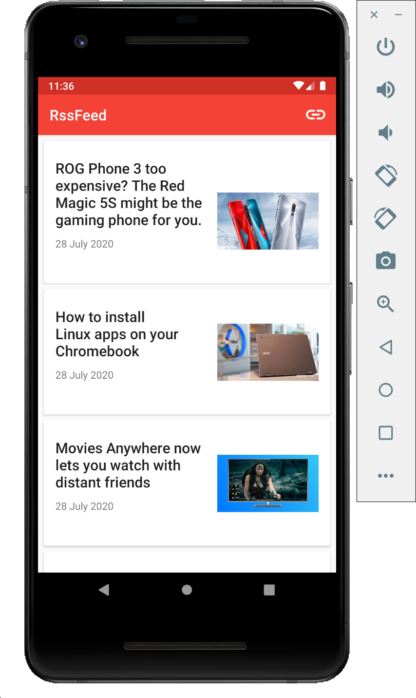
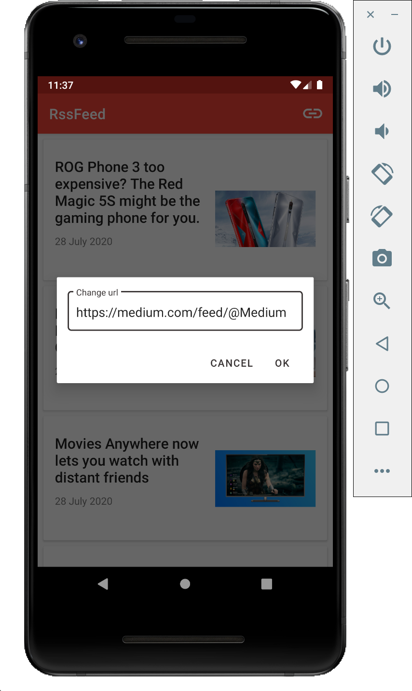
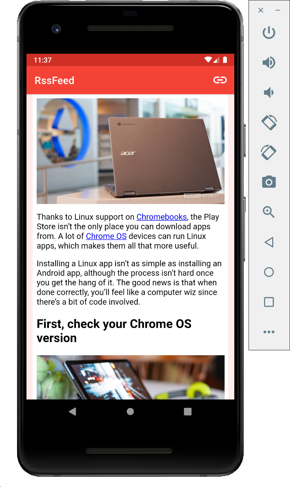

# Rss feed  


## Installation
Clone this repository and import into **Android Studio**
```bash
git clone https://github.com/papuge/Rss-feed.git
```
## Usage
- You can upload rss feed from link in top right corner  
- There's network tracking. You'll get notified about network state changes  

  